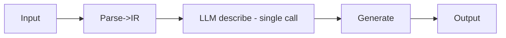
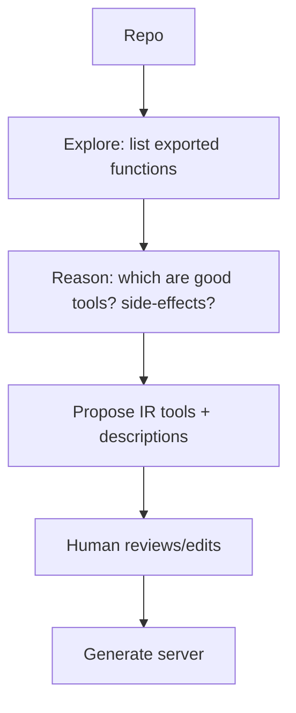

# MCP Server Generator — AGENT DESIGN

**Honest scope:** this product is largely a **deterministic generation pipeline**, not an agentic system — which is correct (workflows > agents for reliability, AGENT_GUIDE.md). Agents appear narrowly. This doc covers both the (mostly non-agentic) generation flow and the optional agent surfaces.

## The generation pipeline is a workflow (by design)
Parse → IR → LLM-describe → template → output. Deterministic, debuggable, fast. No agent loop needed; the only LLM step (description generation) is a single structured call, not an autonomous agent. This is the right architecture — reliability matters and the path is known.

## Where agents do appear
| Agent | Job | Autonomy |
|-------|-----|----------|
| **Codebase-wrapping agent (V2)** | Explore a codebase, decide which functions to expose as tools, infer semantics | Low-Medium (read-only, suggests) |
| **Docs/setup assistant (V2)** | Answer "how do I configure auth/deploy?" via RAG over docs | Low (read-only) |
| **Maintenance agent (Future)** | Detect upstream spec changes, propose regenerated server + changelog | Low (HITL approval) |

## The generated servers ARE for agents
The product's *output* is the agent-tooling layer. Generated servers must follow agent-friendly principles:
- Excellent tool descriptions (so agents choose/call correctly).
- Structured, recoverable errors (so agents retry/adapt).
- Least-privilege, HITL-gated destructive tools (so agents can't do harm).
- Idempotency + timeouts (so agent retries are safe).

So this doc's real "agent design" is **designing servers that agents use well** — the consumer side.

## Codebase-wrapping agent (V2) detail

Read-only exploration; suggests, never auto-ships; human approves the tool surface. Reuses #2's parsing.

## Frameworks
The pipeline needs none. The V2 codebase agent: thin own orchestration or LangGraph if exploration gets complex; Claude Agent SDK for Claude-native. Behind our interfaces.

## Guardrails
Generation runs in a sandbox (untrusted specs/code can't execute); generated code is injection-aware; secrets never embedded; the codebase agent is read-only + HITL. See [GUARDRAILS.md](./GUARDRAILS.md).
