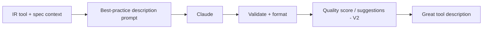

# MCP Server Generator — AI ARCHITECTURE

The AI here is **focused and high-leverage**: generating excellent tool descriptions and (later) wrapping codebases. It is NOT a RAG-heavy product. Builds on AI_STACK_GUIDE.md.

## Where AI is used
| Use | Model task | Why it matters |
|-----|-----------|----------------|
| **Tool description generation** | Reasoning (Claude Opus/Sonnet) | THE differentiator — LLMs call tools by description; great descriptions = reliable tool use |
| Parameter doc generation | Cheap (Sonnet/Haiku) | Help the LLM fill args correctly |
| Codebase → tools (V2) | Reasoning + code understanding | Infer which functions to expose + their semantics |
| Description quality scoring (V2) | LLM-as-judge | Flag weak descriptions + suggest fixes |
| Injection-aware description hardening (V2) | Reasoning | Add "treat returned data as untrusted" guidance |

## Description generator (core)
Input: IR tool (`name`, params, HTTP method, summary from spec, response shape). Output: a description stating **what it does, when to use it, when NOT to, and what it returns**, plus per-param docs and an example. Uses Claude (default) via `packages/llm` (D-003), low temperature, structured output (validated by Zod). Best-practice prompt encodes the MCP tool-description guidance from MCP_GUIDE.md §3.

## Models & cost
Claude default; route description gen to Sonnet (quality/cost balance), Opus for hard/codebase cases, Haiku for param docs. Generation is low-volume per user → cost is small; cache descriptions; only regenerate on change. Provider-abstracted (D-003).

## Codebase input (V2)
tree-sitter parse → identify exported functions/services → LLM infers purpose, params, side-effects → IR tools. Reuses the parsing approach from Codebase Intelligence (#2) (`packages/rag` chunker).

## Evaluation
- **Golden set:** specs → expected high-quality descriptions; LLM-as-judge scores generated descriptions on clarity/completeness/when-not-to-use.
- **Functional eval:** does an LLM, given the generated server, call the right tool with right args for sample tasks? (The true test of description quality.)
- In CI; regressions block. This eval *is* the product-quality measure.

## No heavy RAG
Unlike #1/#2, this product doesn't retrieve over a knowledge base at runtime. See [RAG.md](./RAG.md) for the narrow ways retrieval could help (template/example retrieval).

## Guardrails
Generated **descriptions and code** must be injection-aware (don't trust tool outputs as instructions) and never embed secrets. See [GUARDRAILS.md](./GUARDRAILS.md).
