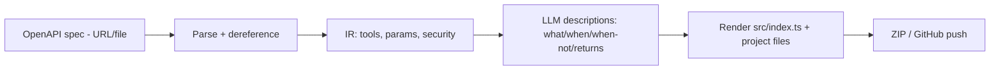

# MCP Server Generator — ARCHITECTURE (MVP)

> The **technical + API architecture** for the 30-day, solo-MERN MVP. Deliberately the *simplest thing that works* — a single Next.js app, a deterministic generation pipeline, no hosting/runtime. The grander multi-input, hosted architecture is the future (see [VISION.md](./VISION.md)); this document is what you actually build first. Pairs with [MVP.md](./MVP.md) (build plan), [MCP.md](./MCP.md) (output contract), [SECURITY.md](./SECURITY.md).

## 1. Executive Summary

The MVP is a **single Next.js application** (frontend + API route handlers — no separate Express server) wrapping a **deterministic generation pipeline**: *parse OpenAPI → Intermediate Representation (IR) → LLM-write tool descriptions → render server code from templates → package as a ZIP*. The only stateful pieces are Postgres (saved generations + subscriptions) and Stripe; the only AI call is a cheap description-generation step. There is **no hosting, no runtime, no queue, no vector DB, no microservices** — those would blow the 30-day budget and aren't needed to validate demand. The architectural keystone is the **IR**: a vendor-neutral model of tools/params/auth that the parser produces and the generator consumes, so adding new inputs (Postgres/GraphQL) later means "add a parser → IR," not "rewrite the generator."

---

## 2. System architecture (MVP)

```mermaid
flowchart TB
    subgraph Client[Next.js app - one deploy]
      LAND[Landing + demo]
      GEN[Generator UI]
      DASH[Dashboard / history - Pro]
    end
    LAND & GEN & DASH --> API[Next.js route handlers]
    API --> PARSE[OpenAPI parser - swagger-parser]
    PARSE --> IR[(IR: Tool[] in memory)]
    IR --> DESC[Description generator - Claude Haiku/Sonnet]
    DESC --> BUILD[Code generator - string templates]
    BUILD --> ZIP[ZIP packager - jszip]
    API --> DB[(Postgres / Neon - Drizzle)]
    API --> STRIPE[Stripe Checkout + webhook]
    API --> GH[GitHub push - Octokit, Pro]
    API --> AUTH[Clerk / Auth.js]
```

One app. One database. One external AI call. Everything else is libraries.

## 3. The generation pipeline (the core)



- **Deterministic by design** (it's a workflow, not an agent). The only probabilistic step is description generation, and its output is validated for shape; if the LLM fails, fall back to spec-derived descriptions.
- **Stateless per request** (except saving the generation). Generation is cheap and fast (< ~10s + a few seconds for descriptions).

## 4. The IR (the keystone abstraction)

```ts
// lib/ir/types.ts
type IRSecurity = { type: 'apiKey'|'bearer'|'oauth2'|'none'; name?: string; in?: 'header'|'query' };
type IRParam = { name: string; in: 'path'|'query'|'header'|'body'; required: boolean; schema: unknown };
type IRTool = {
  name: string;            // derived from operationId/method+path
  method: string;          // GET/POST/...
  path: string;            // /orders/{id}
  summary?: string;        // from spec
  params: IRParam[];
  sideEffecting: boolean;  // POST/PUT/PATCH/DELETE → flagged
  description?: string;    // filled by the LLM step
};
type IR = { title: string; baseUrl: string; security: IRSecurity; tools: IRTool[] };
```
All inputs normalize to `IR`; the generator only knows `IR`. **Adding Postgres/GraphQL later = a new parser → IR**, with zero generator changes. This is the one piece of architecture worth getting right on day one.

## 5. API architecture (route handlers)

| Method | Route | Input | Output | Notes |
|--------|-------|-------|--------|-------|
| POST | `/api/parse` | `{ specUrl }` or multipart file | `{ ir }` (tools list) | swagger-parser; dereferenced; anon rate-limited by IP |
| POST | `/api/generate` | `{ ir, selectedTools[], options }` | SSE progress → `{ files, descriptions }` | streams description progress; gated by plan limits |
| GET | `/api/generations` | — | `{ generations[] }` | Pro; from Postgres |
| GET | `/api/generations/:id/download` | — | ZIP (application/zip) | owner only |
| POST | `/api/github/push` | `{ generationId, repoName, private }` | `{ repoUrl }` | Pro; Octokit |
| POST | `/api/stripe/checkout` | `{ plan }` | `{ url }` | signed-in |
| POST | `/api/webhooks/stripe` | Stripe event (signed) | 200 | sets `users.plan` / `subscriptions.status` |

**Conventions:** JSON; Zod-validated bodies; `problem+json`-style errors; the only cost-incurring route is `/api/generate` (LLM) — meter it and gate by plan. SSE on `/api/generate` for the description-progress UX. No public versioning needed at MVP (it's a web app, not a public API yet).

## 6. Data architecture
Three tables (`users`, `generations`, `subscriptions`) — full DDL in [MVP.md §6](./MVP.md). Postgres (Neon free tier) + Drizzle. **No pgvector** (there is no retrieval in this product). `generations.ir` and `descriptions` are JSONB so a saved generation can be re-rendered or re-pushed without re-parsing.

## 7. What we generate (output architecture — summary)
A complete, runnable TypeScript project using the official `@modelcontextprotocol/sdk` (pinned): `src/index.ts` (tools with Zod schemas, auth from env, structured errors, timeouts), `package.json`, `tsconfig.json`, `README.md`, `mcp.json`, `.env.example`, `.gitignore`. Full output contract + security in [MCP.md](./MCP.md) and [SECURITY.md](./SECURITY.md).

## 8. Non-functional targets (MVP)
- Parse + generate (incl. descriptions) **< ~15s** for a typical spec.
- Generated server **compiles and runs in Claude Desktop** from a real public API (the acceptance test).
- Whole thing runs on **free tiers** (Vercel + Neon + Clerk + tiny LLM spend).
- **No secrets** ever appear in generated code or logs (security invariant).

## 9. What we deliberately do NOT build (MVP)
Hosting/runtime, queues/workers, vector DB, microservices, multi-input parsers, observability dashboards, sandboxes, teams, marketplace. Each is a real future feature and a real way to blow 30 days. The cut-list in [MVP.md §1](./MVP.md) is law.

## 10. Tradeoffs & how the MVP becomes the full product
- **String templates vs. ts-morph:** strings ship faster; upgrade to AST-based codegen when output complexity grows.
- **No hosting:** fastest to ship + validate; hosting is v1 (the recurring-revenue unlock) and slots in behind the same IR/generator.
- **Single app vs. services:** correct for one developer; the generator core can later extract into a package shared with ContextOS (#1) per the lab's monorepo strategy.

## 11. Related Documents
[MVP.md](./MVP.md) · [MCP.md](./MCP.md) · [SECURITY.md](./SECURITY.md) · [API_DESIGN.md](./API_DESIGN.md) · [TECH_STACK.md](./TECH_STACK.md) · [VISION.md](./VISION.md)

*MVP architecture. The hosted, multi-input version is the future, not the first build. Last reviewed 2026-06-20.*
