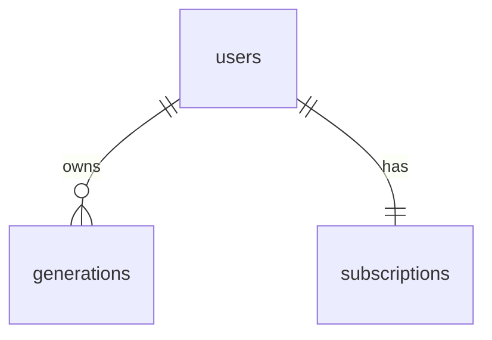

# MCP Server Generator — DATABASE (MVP)

> The complete MVP schema. **No future tables.** The free generator is stateless and needs no database at all; this schema exists only for the **paying (Pro) track** (Week 3). Postgres (Neon) + Drizzle. Pairs with [TECH_STACK.md](./TECH_STACK.md), [ARCHITECTURE.md](./ARCHITECTURE.md).

## 1. Scope note (important)
The **free generator stores nothing** — parse → generate → download is fully stateless. The database is introduced only when you add auth + Pro. If you ship only the free generator (the fastest path to first users), **you can skip this file entirely until Week 3.**

## 2. Tables (3 — that's all)

### `users`
Mirror of the auth provider's identity + plan + Stripe linkage.
| Column | Type | Notes |
|--------|------|-------|
| `id` | text PK | auth provider (Clerk) user id |
| `email` | text not null | |
| `plan` | text not null default `'free'` | `free` \| `pro` |
| `stripe_customer_id` | text null | set on first checkout |
| `created_at` | timestamptz default now() | |

### `generations`
A saved generated server (Pro history). Stores the IR + descriptions so it can be re-rendered/re-downloaded without re-parsing.
| Column | Type | Notes |
|--------|------|-------|
| `id` | uuid PK default gen_random_uuid() | |
| `user_id` | text FK → users.id (on delete cascade) | |
| `name` | text not null | from spec title |
| `source_ref` | text null | spec URL or a content hash |
| `ir` | jsonb not null | the intermediate representation |
| `descriptions` | jsonb null | tool → generated description |
| `endpoint_count` | int | |
| `created_at` | timestamptz default now() | |

### `subscriptions`
Stripe subscription state (kept separate from `users` for clean webhook upserts; **could be merged into `users` for the MVP** if you prefer 2 tables).
| Column | Type | Notes |
|--------|------|-------|
| `user_id` | text PK, FK → users.id (on delete cascade) | |
| `stripe_subscription_id` | text null | |
| `status` | text | `active` \| `canceled` \| `past_due` |
| `current_period_end` | timestamptz null | |

## 3. Relationships (ERD)

That is the entire data model. One user has many generations and one subscription.

## 4. Indexes (MVP — minimal)
```sql
create index generations_user_idx on generations (user_id, created_at desc);  -- history list
create unique index users_email_idx on users (email);
-- subscriptions PK (user_id) and users PK (id) cover the rest
```
No other indexes needed at MVP scale. Add more only when a real query is slow (it won't be at this volume).

## 5. DDL (copy-paste)
```sql
create table users (
  id text primary key,
  email text not null,
  plan text not null default 'free',
  stripe_customer_id text,
  created_at timestamptz default now()
);
create unique index users_email_idx on users (email);

create table generations (
  id uuid primary key default gen_random_uuid(),
  user_id text not null references users(id) on delete cascade,
  name text not null,
  source_ref text,
  ir jsonb not null,
  descriptions jsonb,
  endpoint_count int,
  created_at timestamptz default now()
);
create index generations_user_idx on generations (user_id, created_at desc);

create table subscriptions (
  user_id text primary key references users(id) on delete cascade,
  stripe_subscription_id text,
  status text,
  current_period_end timestamptz
);
```

## 6. Explicitly NOT in the schema (future tables — do not add)
`orgs`, `teams`, `memberships`, `api_keys`, `hosted_servers`, `tool_calls`, `usage_records`, `templates`, `registry_listings`, `audit_logs`, anything with `vector`. These belong to the hosted/platform future, not the 30-day MVP.

## 7. Migrations & data lifecycle
Drizzle migrations, forward-only. Account deletion cascades to `generations` + `subscriptions` (right-to-delete, cheap to honor). No partitioning, no retention jobs — unnecessary at MVP scale.

## Related
[TECH_STACK.md](./TECH_STACK.md) · [ARCHITECTURE.md](./ARCHITECTURE.md) · [API_DESIGN.md](./API_DESIGN.md)

*MVP-scoped. 3 tables, no future tables. Last reviewed 2026-06-20.*
