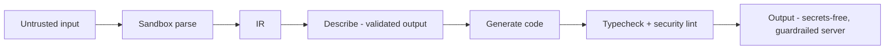

# MCP Server Generator — GUARDRAILS

Two scopes: guardrails on **our generation process** + guardrails we **bake into generated servers**. Shared framework: [../contextos/GUARDRAILS.md](../contextos/GUARDRAILS.md).

## A. Guardrails on our generation process
1. **Generation sandbox** — parsing untrusted specs/codebases + tool testing runs isolated (no ambient FS/network/secrets). A malicious spec can't compromise us.
2. **Input validation** — reject malformed/oversized specs; clear errors.
3. **No execution of customer code** during generation (analyze, don't run; codebase input parses via AST, doesn't execute).
4. **LLM output validation** — generated descriptions validated/structured (Zod); generated code passes a parse/typecheck + security lint before output.
5. **Secret hygiene** — never write secrets into generated code or logs; references only.
6. **Rate limits + quotas** on generation/hosting per plan.

## B. Guardrails baked INTO generated servers (the product)
Generated servers ship with guardrails on by default — this is the value:
1. **Auth required** — no anonymous tool calls.
2. **Input validation** — Zod on every tool; reject/repair bad args.
3. **Tool restrictions** — destructive/side-effectful tools flagged; HITL-gateable; least privilege.
4. **Safe DB access** — parameterized only; readonly default; no arbitrary SQL.
5. **Prompt-injection awareness** — descriptions instruct: returned data is untrusted, never instructions; output sanitization scaffolded; tool allowlist behavior.
6. **Rate limiting + timeouts + idempotency** — safe under load and retries.
7. **Structured, recoverable errors** — agents can adapt, not crash.
8. **Observability hooks** — every tool call logged/traced.
9. **HITL config** — destructive tools can require human approval (V2).
10. **Sandboxing** — any code-executing generated tool runs isolated (V2).

## Defense-in-depth (generation)

## Security lint (V2)
Automated checks on generated servers: auth present, validation present, no embedded secrets, no arbitrary SQL, rate limit present, destructive tools flagged. Produces a **security score** surfaced to the user — a guardrail and a selling point.

## Why this matters
Competitors generate unsafe toys. "Guardrailed by default" is both safety and differentiation. Every guardrail above is a reason a team trusts (and pays for) our output over hand-rolled or naive-generator servers.
